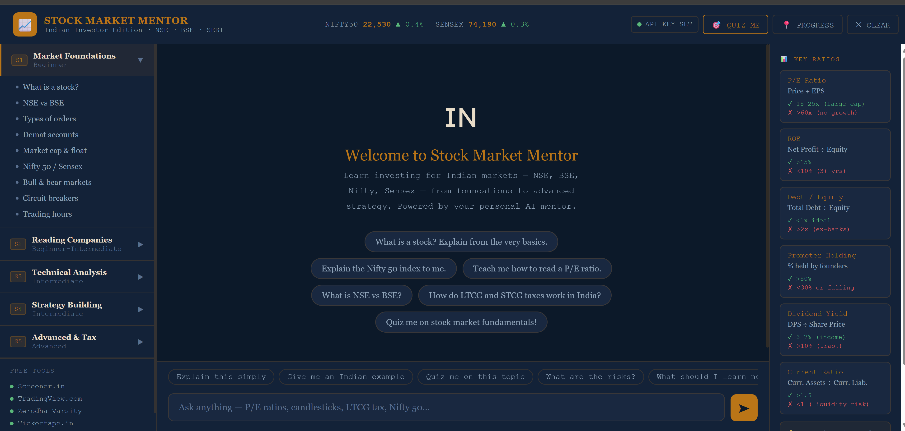

# 📈 Stock Market Mentor — Indian Investor Edition

> An AI-powered, interactive stock market learning app for Indian retail investors — built with the Claude API and vanilla HTML/CSS/JS. No frameworks. No backend. Runs entirely in the browser.



[](https://YOUR_USERNAME.github.io/stock-market-mentor)
[](https://anthropic.com)
[](LICENSE)
[-lightgrey?style=flat-square)]()

---

## 🎯 What This Is

A **fully functional AI tutoring app** that teaches Indian stock market investing — from Nifty 50 basics to LTCG tax strategy — using a structured 5-semester curriculum powered by Claude AI.

Built to demonstrate practical AI integration skills: prompt engineering, API design, and building production-quality tools with LLMs.

---

## ✨ Features

| Feature | Details |
|--------|---------|
| 🤖 **AI Mentor** | Claude-powered responses following Teach → Example → Exercise → Check format |
| 📚 **5-Semester Curriculum** | Market Foundations → Reading Companies → Technical Analysis → Strategy → Advanced Tax |
| 🇮🇳 **India-Specific** | NSE/BSE, Nifty/Sensex, SEBI regulations, LTCG/STCG tax, ₹ examples |
| 🎯 **Quiz Mode** | MCQ quizzes with real Indian company data (Reliance, TCS, HDFC Bank) |
| 📊 **Key Ratios Panel** | Live reference card: P/E, ROE, Debt/Equity, Promoter Holding, Dividend Yield |
| 🔑 **Secure Key Handling** | Users enter their own API key — no secrets ever stored in code |
| 🛠️ **Zero Dependencies** | Pure HTML + CSS + JS — no npm, no build step, no backend |

---

## 🚀 Live Demo

👉 **[Try it here](https://YOUR_USERNAME.github.io/stock-market-mentor)**

You'll need a free Anthropic API key from [console.anthropic.com](https://console.anthropic.com) to use the AI features.

---

## 🏗️ How It Works

```
Browser
  └── index.html (single file app)
        ├── UI Layer: Sidebar curriculum, chat window, ratios panel
        ├── Prompt Engine: 5-semester system prompt with TEACH→CHECK format
        └── API Layer: Direct fetch() to api.anthropic.com/v1/messages
                              ↑
                       User's own API key
                       (entered at runtime, never stored)
```

**Key architectural decision:** The app calls the Anthropic API directly from the browser using the `anthropic-dangerous-direct-browser-access` header. This keeps the app completely serverless — no Node.js, no proxy, no cloud functions needed.

---

## 🧠 Prompt Engineering Highlights

The AI mentor is powered by a carefully crafted system prompt that enforces:

- **Structured lesson format**: Every response follows CONCEPT → INDIAN EXAMPLE → NUMBERS → RISK → EXERCISE → CHECK
- **Indian market grounding**: Responses always reference NSE/BSE stocks, SEBI rules, and ₹ figures
- **Progressive pedagogy**: Never skips ahead; checks understanding before moving on
- **Safety-first framing**: Risk context mandatory alongside every opportunity discussed

> This is a practical example of **role prompting + format prompting + constraint prompting** working together.

---

## 📂 Project Structure

```
stock-market-mentor/
├── index.html          # Entire application (UI + logic + prompt)
├── README.md           # This file
├── LICENSE             # MIT License
└── assets/
    └── preview.png     # Screenshot for README
```

---

## 🛠️ Run Locally

No setup required. Just clone and open:

```bash
git clone https://github.com/YOUR_USERNAME/stock-market-mentor.git
cd stock-market-mentor
# Open index.html in any browser
open index.html        # macOS
start index.html       # Windows
```

Enter your Anthropic API key when prompted. That's it.

---

## 🌐 Deploy to GitHub Pages

1. Push this repo to GitHub
2. Go to **Settings → Pages**
3. Set source to **Deploy from branch → main → / (root)**
4. Your app is live at `https://YOUR_USERNAME.github.io/stock-market-mentor`

---

## 💡 What I Learned / Skills Demonstrated

- **Claude API integration** — direct browser-to-API calls, message history management, streaming awareness
- **Prompt engineering** — multi-constraint system prompts, persona design, structured output formatting
- **Vanilla JS architecture** — state management, dynamic DOM, event handling without any framework
- **UX for AI apps** — progressive disclosure, starter prompts, quick-reply chips, loading states
- **Security-conscious design** — user-supplied credentials, no secrets in source, session-only storage

---

## 📚 The Curriculum

| Semester | Topic | Level |
|----------|-------|-------|
| S1 | Market Foundations | Beginner |
| S2 | Reading Companies (Fundamentals) | Beginner-Intermediate |
| S3 | Charts & Technical Analysis | Intermediate |
| S4 | Strategy Building | Intermediate |
| S5 | Advanced Topics & Taxation | Advanced |

---

## ⚠️ Disclaimer

All content is for **educational purposes only**. This is not SEBI-registered investment advice. Real market investments carry risk of capital loss. Always consult a SEBI-registered advisor before investing.

---

## 📄 License

MIT — free to use, fork, and build on.

---

*Built by [Purushu](https://github.com/YOUR_USERNAME) · Powered by [Claude API](https://anthropic.com)*
